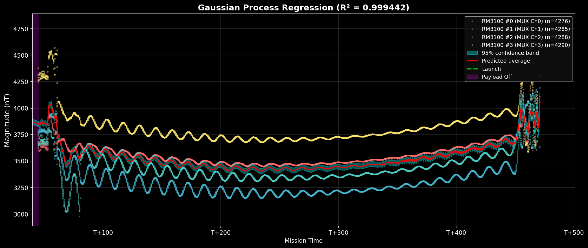
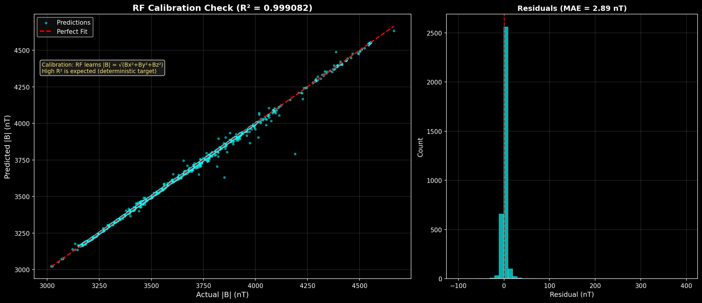

# RockSat-X 2026 — Real-Time ML Flight Software


This deposit contains the Machine Learning pipeline developed for a sounding rocket flight experiment out of Wallops Flight Facility, part of the **RockSat-X** program. 


The software acts as a highly optimized, real-time edge computing engine running on a **Raspberry Pi 5** during a suborbital space flight. The system ingests in-flight telemetry from an array of RM3100 Magnetometers at a high sampling frequency, detects hardware and software anomalies on the fly, and logs robust sensor diagnostics prior to payload power cutoff before reentry.

> [!NOTE]
> **Confidentiality Notice:** Because this project interfaces with proprietary suborbital flight hardware, certain components have been omitted from this public repository. **Missing files include raw pre-flight and in-flight telemetry datasets (`data/`), trained ML weights derived from proprietary mission events (`models/`), and the team's low-level hardware communication drivers (`sensors/`).** The machine learning pipeline structure and algorithms are showcased here as a portfolio demonstration.

---

## 🚀 Key Features and Capabilities

* **Hardware-Accelerated Neural Networks:** Performs highly efficient inferencing via a **Hailo-8 NPU**, running a 1D Convolutional Neural Network (FCN) without overloading the Pi's CPU cores.
* **Aggressive Threaded I/O & Queueing:** Utilizes a producer-consumer architecture allocating multi-core processing bounds. The sensor thread polls the I2C registers in binary natively without string conversions at **45 Hz**, dumping data directly into bounded `queue.Queue` buffers to prevent pipeline halts.
* **Ensemble Outlier & Anomaly Detection:** Dynamically assesses in-flight anomalies evaluating multi-sensor consensus utilizing real-time **Isolation Forests**, Adaptive Modified **Z-Scores**, **Local Outlier Factors (LOF)**, and rapid **Rate-of-Change** filtering.
* **Physics-Grounded Clustering:** Utilizes **DBSCAN / K-Means** methodologies processing real-time derived multi-axis vectors `(dx/dt, dy/dt, d|B|/dt)` to cluster suborbital flight paradigms (e.g., spin rate artifacts vs. true physical phenomena).
* **Guaranteed No-Data-Loss Logging:** Raw sensor telemetry strictly bypasses the ML pipeline to be safely dumped to `fsync` flush intervals immediately minimizing data loss if a hard power loss occurs prematurely.

## 🛠️ Technology Stack

* **Core Platform:** Python 3.11 on ARM64 Debian (Raspberry Pi 5)
* **ML Infrastructure:** Scikit-learn, TensorFlow / Keras, Hailo Dataflow Compiler (DFC)
* **Data Processing:** NumPy, Pandas, SciPy, Joblib
* **Hardware Interfacing:** SMBus (Native I2C / MUX bindings)
* **Testing:** PyTest, multi-stage validation scripts

---

## 🧠 System Architecture Overview

### 1. `test_main.py` (Real-Time Inference Engine)
The fundamental flight pipeline. Operates exclusively within a highly locked edge-compute timeline allowance per sensor loop (~22 ms). Pushes real-time vector inputs (`[Bx, By, Bz]`) to:
1. **Random Forest Regression** for geometric magnitude vector verification.
2. **Neural Network inference** (Hailo NPU primary, TensorFlow CPU fallback) checking component scaling.
3. Adaptive memory buffer updates for moving target temporal prediction.

### 2. `main.py` & `post_flight.py` (Analysis and Visualization)
Handles generalized data ingestion for local testing and recovery mapping. After payload recovery, `post_flight.py` is capable of interpolating the mission flight CSV and `output/` dynamically plots:
* Sensor phase offsets & rotation regimes.
* RF versus NN component accuracy and residual error histograms.
* Sliding-window forecasting plots highlighting anomaly triggers.

### 3. Verification Automation Suite (`validate_pipeline.py`)
An 88-test validation script designed to robustly stress the integrity of the data structures. Proves time independence to prevent memory leakages, assures constant bounded execution loads, validates cluster stability, and ensures deterministic algorithm outputs under erratic payload movement.

## 📊 Model Performance

All models trained on **18,453 combined samples** from two sounding rocket missions (Virginia 2025 + GHOST Norway 2025), spanning magnetic environments from 1,391–5,162 nT.

| Model | Purpose | Virginia R² | GHOST R² |
|-------|---------|------------|---------|
| Random Forest | Magnitude prediction + sensor validation | 0.9959 | 0.9991 |
| Neural Network (FCN → Hailo .hef) | NPU-accelerated magnitude prediction | — | 0.9990 |
| Gaussian Process (ARD) | Prediction + uncertainty quantification | 0.9994 | 0.9994 |
| Temporal RF | Sliding-window next-magnitude forecast | 0.9142 | — |
| Anomaly Ensemble | IF + Z-Score + LOF + RoC (2+ vote threshold) | 8 flagged | 111 flagged |

## 📈 Output & Visual Proof

Because the raw datasets are proprietary, the following output visualizations are provided to demonstrate the efficacy of the universal models operating on the flight telemetry:

### 1. GPR Sensor Uncertainty Bands
<p align="center">
  
</p>
*Provides real-time confidence intervals alongside magnitude predictions.*

### 2. Random Forest Magnitude Evaluation
<p align="center">
  
</p>
*High R² scores on derived geometric magnitude vectors independent of localized magnetic coordinates.*

---

## ⚡ Deployment & Running Example (Local Dev)

Because flight datasets are excluded from this public release, model retraining requires proprietary mission data. The validation suite, audit scripts, and flight simulator run independently:

```bash
# Setup the Python environment
python3 -m venv venv
source venv/bin/activate
pip install -r requirements.txt

# Run the full test-validation suite
python3 validate_pipeline.py

# Run the model auditor (proves algorithms don't memorize time features)
python3 audit_models.py

# Simulate the flight script on local machine with a dummy payload CSV
python3 sim_flight.py
```

---
*University of Puerto Rico, Río Piedras · NASA RockSat-X 2026 Program · Wallops Flight Facility*
